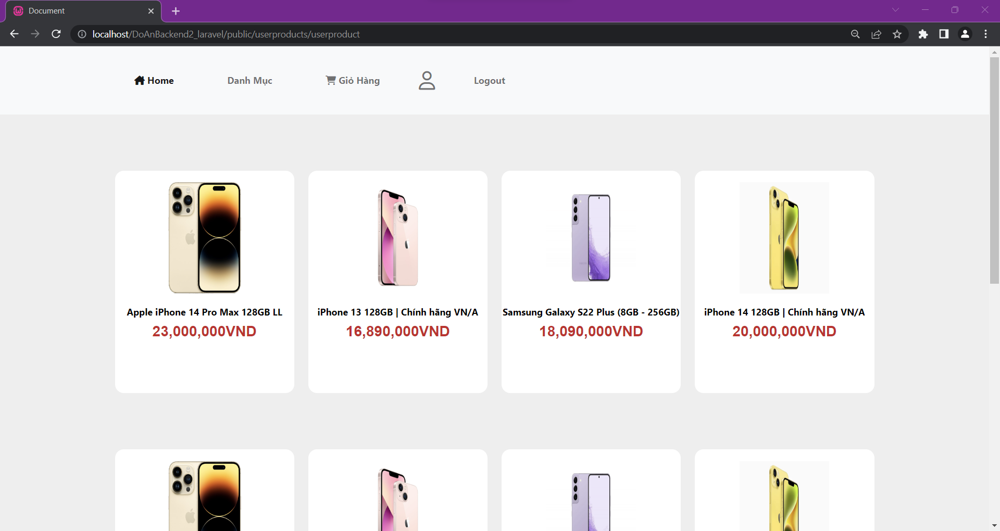

#Screen User

    <b>
        login
    </b>

    <b>
        register
    </b>

    <b>
        Change password
    </b>

    <b>
        login
    </b>

    <b>
        Product detail
    </b>

    <b>
        Cart
    </b>

#Screen Admin

    <b>
        Screen product
    </b>

    <b>
        Add product
    </b>

    <b>
        Categories detail
    </b>

    <b>
        edit category
    </b>

    <b>
        List cart
    </b>

    <b>
        promotional card
    </b>

